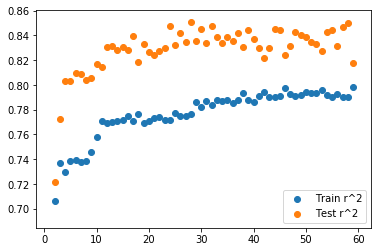
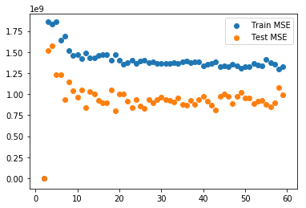

# Feature Selection: An Introduction to Advanced Regression Techniques

In this lab you'll continue to investigate regression models and how models can be over or underfit. We'll also continue to see the role multicollinearity plays in creating regression models. This will then lead us to investigating Regularization techniques such as Lasso and Ridge regression in the next section.  

Today's dataset has a large number of features concerning real estate properties. The final column of this dataset is 'Sales Price' which we would like to create a regression model for. This model could have several purposes. First, if we have data about a property, we would like to know roughly how much the property is apt to sell for. Secondly, we would like to know what features (such as location, number of bedrooms, bathrooms, etc.) are most impactful in determining sales price so that we could prioritize potential home improvements to increase profits.

# Recall the General Outline for Regression

1. Import Data
2. Preprocess
3. Train-Test Split
4. Initialize Model
5. Fit Model
6. Calculate Errors
7. Repeat steps 2-6 with additional feature engineering 

# 1) Import the Data


```python
import pandas as pd
```


```python
df = pd.read_csv('Housing_Kaggle/train.csv')
print(len(df))
df.head()
```

    1460


<div>
<style scoped>
    .dataframe tbody tr th:only-of-type {
        vertical-align: middle;
    }

    .dataframe tbody tr th {
        vertical-align: top;
    }

    .dataframe thead th {
        text-align: right;
    }
</style>
<table border="1" class="dataframe">
  <thead>
    <tr style="text-align: right;">
      <th></th>
      <th>Id</th>
      <th>MSSubClass</th>
      <th>MSZoning</th>
      <th>LotFrontage</th>
      <th>LotArea</th>
      <th>Street</th>
      <th>Alley</th>
      <th>LotShape</th>
      <th>LandContour</th>
      <th>Utilities</th>
      <th>...</th>
      <th>PoolArea</th>
      <th>PoolQC</th>
      <th>Fence</th>
      <th>MiscFeature</th>
      <th>MiscVal</th>
      <th>MoSold</th>
      <th>YrSold</th>
      <th>SaleType</th>
      <th>SaleCondition</th>
      <th>SalePrice</th>
    </tr>
  </thead>
  <tbody>
    <tr>
      <th>0</th>
      <td>1</td>
      <td>60</td>
      <td>RL</td>
      <td>65.0</td>
      <td>8450</td>
      <td>Pave</td>
      <td>NaN</td>
      <td>Reg</td>
      <td>Lvl</td>
      <td>AllPub</td>
      <td>...</td>
      <td>0</td>
      <td>NaN</td>
      <td>NaN</td>
      <td>NaN</td>
      <td>0</td>
      <td>2</td>
      <td>2008</td>
      <td>WD</td>
      <td>Normal</td>
      <td>208500</td>
    </tr>
    <tr>
      <th>1</th>
      <td>2</td>
      <td>20</td>
      <td>RL</td>
      <td>80.0</td>
      <td>9600</td>
      <td>Pave</td>
      <td>NaN</td>
      <td>Reg</td>
      <td>Lvl</td>
      <td>AllPub</td>
      <td>...</td>
      <td>0</td>
      <td>NaN</td>
      <td>NaN</td>
      <td>NaN</td>
      <td>0</td>
      <td>5</td>
      <td>2007</td>
      <td>WD</td>
      <td>Normal</td>
      <td>181500</td>
    </tr>
    <tr>
      <th>2</th>
      <td>3</td>
      <td>60</td>
      <td>RL</td>
      <td>68.0</td>
      <td>11250</td>
      <td>Pave</td>
      <td>NaN</td>
      <td>IR1</td>
      <td>Lvl</td>
      <td>AllPub</td>
      <td>...</td>
      <td>0</td>
      <td>NaN</td>
      <td>NaN</td>
      <td>NaN</td>
      <td>0</td>
      <td>9</td>
      <td>2008</td>
      <td>WD</td>
      <td>Normal</td>
      <td>223500</td>
    </tr>
    <tr>
      <th>3</th>
      <td>4</td>
      <td>70</td>
      <td>RL</td>
      <td>60.0</td>
      <td>9550</td>
      <td>Pave</td>
      <td>NaN</td>
      <td>IR1</td>
      <td>Lvl</td>
      <td>AllPub</td>
      <td>...</td>
      <td>0</td>
      <td>NaN</td>
      <td>NaN</td>
      <td>NaN</td>
      <td>0</td>
      <td>2</td>
      <td>2006</td>
      <td>WD</td>
      <td>Abnorml</td>
      <td>140000</td>
    </tr>
    <tr>
      <th>4</th>
      <td>5</td>
      <td>60</td>
      <td>RL</td>
      <td>84.0</td>
      <td>14260</td>
      <td>Pave</td>
      <td>NaN</td>
      <td>IR1</td>
      <td>Lvl</td>
      <td>AllPub</td>
      <td>...</td>
      <td>0</td>
      <td>NaN</td>
      <td>NaN</td>
      <td>NaN</td>
      <td>0</td>
      <td>12</td>
      <td>2008</td>
      <td>WD</td>
      <td>Normal</td>
      <td>250000</td>
    </tr>
  </tbody>
</table>
<p>5 rows × 81 columns</p>
</div>


```python
pd.plotting.scatter_matrix(df, figsize=(15,15));
```

# Feature selection by adding one attribute at a time
Iterate through each feature and calculate the r^2 coefficient for at least 3 different train test split samples. Store these values in a dictionary so that you have
model_scores = {col_name : (avg_r^2_train, avg_r^2_test)} for each column. Then create a dataframe of these values and sort it by the average test score. Preview the top 5 predictive features.


```python
import numpy as np
import matplotlib.pyplot as plt
import seaborn as sns
from sklearn.linear_model import LinearRegression
from sklearn.model_selection import train_test_split
%matplotlib inline
```


```python
X = df.drop('SalePrice', axis=1)
y = df.SalePrice
```


```python
ols = LinearRegression()
model_scores = {}
for col in X.columns:
    try:
        train_r2 = []
        test_r2 = []
        for i in range(3):
            X_train, X_test, y_train, y_test = train_test_split(X, y)
            ols.fit(np.array(X_train[col]).reshape(-1,1), y_train)
            train_r2.append(ols.score(np.array(X_train[col]).reshape(-1,1), y_train))
            test_r2.append(ols.score(np.array(X_test[col]).reshape(-1,1), y_test))
        model_scores[col] = (np.mean(train_r2), np.mean(test_r2))
        if col == 'OverallQual':
            print(model_scores[col])
    except:
        continue
#         print("Couldn't perform regression using {}, probably not a numeric feature.".format(col))
#         print("Top feature attributes:\n", df[col].value_counts(normalize=True)[:5])
model_scores = pd.DataFrame.from_dict(model_scores, orient='index')
model_scores.columns = ['Train_r2', 'Test_r2']
model_scores = model_scores.sort_values(by='Test_r2', ascending=False)
model_scores.head()
```

    (0.6233504337091215, 0.6347596402211834)


<div>
<style scoped>
    .dataframe tbody tr th:only-of-type {
        vertical-align: middle;
    }

    .dataframe tbody tr th {
        vertical-align: top;
    }

    .dataframe thead th {
        text-align: right;
    }
</style>
<table border="1" class="dataframe">
  <thead>
    <tr style="text-align: right;">
      <th></th>
      <th>Train_r2</th>
      <th>Test_r2</th>
    </tr>
  </thead>
  <tbody>
    <tr>
      <th>OverallQual</th>
      <td>0.623350</td>
      <td>0.634760</td>
    </tr>
    <tr>
      <th>TotalBsmtSF</th>
      <td>0.360389</td>
      <td>0.423886</td>
    </tr>
    <tr>
      <th>GrLivArea</th>
      <td>0.526070</td>
      <td>0.412337</td>
    </tr>
    <tr>
      <th>GarageArea</th>
      <td>0.381030</td>
      <td>0.410302</td>
    </tr>
    <tr>
      <th>GarageCars</th>
      <td>0.416398</td>
      <td>0.386165</td>
    </tr>
  </tbody>
</table>
</div>


```python
# Your code here
#Iterate through columns
#Perform a regression for 3 different train-test splits
#Calculate train / test r^2 for each split
#Store avg train r^2 and avg test r^2 in master dictionary
#Turn master dictionary into dataframe
#Sort dataframe by test r^2
#Preview top 5 predictive features.
```

# Find the second most impactful feature in addition to the first.
Iterate back through all of the column features (except Make note of the most predictive feature from above. Repeat the process to find the second most useful feature in conjunction with the most important feature. **Be sure to include 2 variables in each of your models; one will always be the most predictive from the previous exercise and the second will be some other column.** 


```python
# Your code here
ols = LinearRegression()
model2_scores = {}
cur_feats = ['OverallQual']
for iteration, col in enumerate(X.columns):
    try:
        train_r2 = []
        test_r2 = []
        feats = cur_feats + [col]
        for i in range(3):
            X_train, X_test, y_train, y_test = train_test_split(X, y)
            ols.fit(X_train[feats], y_train)
            train_r2.append(ols.score(X_train[feats], y_train))
            test_r2.append(ols.score(X_test[feats], y_test))
        model2_scores[col] = (np.mean(train_r2), np.mean(test_r2))
    except Exception as e:
        if iteration < 5:
            print(e)
        continue
#         print("Couldn't perform regression using {}, probably not a numeric feature.".format(col))
#         print("Top feature attributes:\n", df[col].value_counts(normalize=True)[:5])
model2_scores = pd.DataFrame.from_dict(model2_scores, orient='index')
model2_scores.columns = ['Train_r2', 'Test_r2']
model2_scores = model2_scores.sort_values(by='Test_r2', ascending=False)
model2_scores.head()
```

    could not convert string to float: 'RL'
    Input contains NaN, infinity or a value too large for dtype('float64').


<div>
<style scoped>
    .dataframe tbody tr th:only-of-type {
        vertical-align: middle;
    }

    .dataframe tbody tr th {
        vertical-align: top;
    }

    .dataframe thead th {
        text-align: right;
    }
</style>
<table border="1" class="dataframe">
  <thead>
    <tr style="text-align: right;">
      <th></th>
      <th>Train_r2</th>
      <th>Test_r2</th>
    </tr>
  </thead>
  <tbody>
    <tr>
      <th>GrLivArea</th>
      <td>0.716578</td>
      <td>0.694518</td>
    </tr>
    <tr>
      <th>TotRmsAbvGrd</th>
      <td>0.666643</td>
      <td>0.691269</td>
    </tr>
    <tr>
      <th>1stFlrSF</th>
      <td>0.693233</td>
      <td>0.688560</td>
    </tr>
    <tr>
      <th>GarageArea</th>
      <td>0.667524</td>
      <td>0.686759</td>
    </tr>
    <tr>
      <th>GarageCars</th>
      <td>0.666893</td>
      <td>0.670151</td>
    </tr>
  </tbody>
</table>
</div>


# Notes: Messy Scratchpad

Here we demonstrate how you might start investigating and pulling apart some of the more complex nested objects in the code snippet above. This is how you yourself might play around with the code as you write and build a longer block like above, or try to decipher a longer block of code.


```python
cur_feats
```


    ['OverallQual']


```python
col
```


    'SaleCondition'


```python
cur_feats + [col]
```


    ['OverallQual', 'SaleCondition']


```python
model2_scores.head()
```


<div>
<style scoped>
    .dataframe tbody tr th:only-of-type {
        vertical-align: middle;
    }

    .dataframe tbody tr th {
        vertical-align: top;
    }

    .dataframe thead th {
        text-align: right;
    }
</style>
<table border="1" class="dataframe">
  <thead>
    <tr style="text-align: right;">
      <th></th>
      <th>Train_r2</th>
      <th>Test_r2</th>
    </tr>
  </thead>
  <tbody>
    <tr>
      <th>GrLivArea</th>
      <td>0.716578</td>
      <td>0.694518</td>
    </tr>
    <tr>
      <th>TotRmsAbvGrd</th>
      <td>0.666643</td>
      <td>0.691269</td>
    </tr>
    <tr>
      <th>1stFlrSF</th>
      <td>0.693233</td>
      <td>0.688560</td>
    </tr>
    <tr>
      <th>GarageArea</th>
      <td>0.667524</td>
      <td>0.686759</td>
    </tr>
    <tr>
      <th>GarageCars</th>
      <td>0.666893</td>
      <td>0.670151</td>
    </tr>
  </tbody>
</table>
</div>


```python
model2_scores.index[0]
```


    'GrLivArea'


```python
model2_scores.iloc[0]
```


    Train_r2    0.716578
    Test_r2     0.694518
    Name: GrLivArea, dtype: float64


```python
type(model2_scores.iloc[0])
```


    pandas.core.series.Series


```python
model2_scores.iloc[0]['Train_r2']
```


    0.716577872870524


```python
tuple(model2_scores.iloc[0])
```


    (0.716577872870524, 0.6945179914955402)


# Continue adding features, one at a time and graph train / test accuracy against number of features.
#### Hint: First formalize the previous question as a function. 
The graph should include the number of model feaures on the x axis and the  r^2 values for the train and test splits on the y-axis.


```python
def add_feature(cur_feats, X, y):
    ols = LinearRegression()
    model_scores = {}
    for iteration, col in enumerate(X.columns):
        try:
            train_r2 = []
            test_r2 = []
            feats = cur_feats + [col]
            for i in range(3):
                X_train, X_test, y_train, y_test = train_test_split(X, y)
                ols.fit(X_train[feats], y_train)
                train_r2.append(ols.score(X_train[feats], y_train))
                test_r2.append(ols.score(X_test[feats], y_test))
            model_scores[col] = (np.mean(train_r2), np.mean(test_r2))
        except Exception as e:
#             if iteration < 5:
#                 print(e)
            continue
    model_scores = pd.DataFrame.from_dict(model_scores, orient='index')
    model_scores.columns = ['Train_r2', 'Test_r2']
    model_scores = model_scores.sort_values(by='Test_r2', ascending=False)
    new_feat = model_scores.index[0]
    cur_feats.append(new_feat)
    new_model_scores = [len(cur_feats)] + list(model_scores.iloc[0])
    return cur_feats, new_model_scores
```

# Notes
* Notice that once OverallQual is in the model, adding it again does not add more predictive value
* Notice that while GrLivArea was the second most important feature by itself, the feature importance of some of the other top features shuffled when in conjunction with 'OverallQual'.
* Notice that while the overall r^2 continues to improve, our gains are starting to trail off (we also cannot ever get >1 as an r^2 value)


```python
[2] + list(model2_scores.iloc[0])
```


    [2, 0.716577872870524, 0.6945179914955402]


```python
cur_feats = ['OverallQual', 'GrLivArea']
model_scores = [[2, 0.7064032126207153, 0.7216830264190167]] #List of nested lists [[n_feats, train_r2, test_r2], [n_feats, train_r2, test_r2], ... ]
for i in range(3,60):
    cur_feats, new_model_scores = add_feature(cur_feats, X, y)
    model_scores.append(new_model_scores)
    print('Current Number of Features:', new_model_scores[0])
    print('Current Train r^2:', new_model_scores[1])
    print('Current Test r^2:', new_model_scores[2])
```

    Current Number of Features: 3
    Current Train r^2: 0.736945800689269
    Current Test r^2: 0.7728662620677277
    Current Number of Features: 4
    Current Train r^2: 0.7296746311388443
    Current Test r^2: 0.802890288384288
    Current Number of Features: 5
    Current Train r^2: 0.7383860032649384
    Current Test r^2: 0.8034660818091846
    Current Number of Features: 6
    Current Train r^2: 0.7396986061252764
    Current Test r^2: 0.8094431211187771
    Current Number of Features: 7
    Current Train r^2: 0.7377551375186068
    Current Test r^2: 0.8087931208141188
    Current Number of Features: 8
    Current Train r^2: 0.7386686932322865
    Current Test r^2: 0.8040328471035711
    Current Number of Features: 9
    Current Train r^2: 0.7458856342559733
    Current Test r^2: 0.8059574499793091
    Current Number of Features: 10
    Current Train r^2: 0.7581707397588575
    Current Test r^2: 0.8168693231518106
    Current Number of Features: 11
    Current Train r^2: 0.7708226633165579
    Current Test r^2: 0.8144927677429649
    Current Number of Features: 12
    Current Train r^2: 0.7691200230769318
    Current Test r^2: 0.830764937977928
    Current Number of Features: 13
    Current Train r^2: 0.7700479706180969
    Current Test r^2: 0.8312516389497723
    Current Number of Features: 14
    Current Train r^2: 0.7704719323484248
    Current Test r^2: 0.8278955705764073
    Current Number of Features: 15
    Current Train r^2: 0.7718908618944722
    Current Test r^2: 0.8309125848528979
    Current Number of Features: 16
    Current Train r^2: 0.7749931399178888
    Current Test r^2: 0.8282015925855943
    Current Number of Features: 17
    Current Train r^2: 0.7705639021277929
    Current Test r^2: 0.8393206769415068
    Current Number of Features: 18
    Current Train r^2: 0.7767410524085315
    Current Test r^2: 0.818620003295239
    Current Number of Features: 19
    Current Train r^2: 0.7689319481456165
    Current Test r^2: 0.8331016008374942
    Current Number of Features: 20
    Current Train r^2: 0.7709823908552352
    Current Test r^2: 0.8265308768097502
    Current Number of Features: 21
    Current Train r^2: 0.7735306863023284
    Current Test r^2: 0.8238957666421808
    Current Number of Features: 22
    Current Train r^2: 0.7739250007555224
    Current Test r^2: 0.8273326161401132
    Current Number of Features: 23
    Current Train r^2: 0.771741222802767
    Current Test r^2: 0.8297526384702844
    Current Number of Features: 24
    Current Train r^2: 0.7716511943298346
    Current Test r^2: 0.8474950918799588
    Current Number of Features: 25
    Current Train r^2: 0.7773789383160318
    Current Test r^2: 0.8320102560401824
    Current Number of Features: 26
    Current Train r^2: 0.7750163022887047
    Current Test r^2: 0.841799294909699
    Current Number of Features: 27
    Current Train r^2: 0.775114192146848
    Current Test r^2: 0.8343253746969322
    Current Number of Features: 28
    Current Train r^2: 0.7768976485000626
    Current Test r^2: 0.8504152594188347
    Current Number of Features: 29
    Current Train r^2: 0.7861627688852412
    Current Test r^2: 0.8357862268374875
    Current Number of Features: 30
    Current Train r^2: 0.782457538245291
    Current Test r^2: 0.8451989352169312
    Current Number of Features: 31
    Current Train r^2: 0.7869928699008849
    Current Test r^2: 0.8338912868096134
    Current Number of Features: 32
    Current Train r^2: 0.7838152320952588
    Current Test r^2: 0.8478731260194659
    Current Number of Features: 33
    Current Train r^2: 0.7880772408853414
    Current Test r^2: 0.8386617014517389
    Current Number of Features: 34
    Current Train r^2: 0.7870819255253944
    Current Test r^2: 0.8342282701017073
    Current Number of Features: 35
    Current Train r^2: 0.7878469269573078
    Current Test r^2: 0.8388011825306204
    Current Number of Features: 36
    Current Train r^2: 0.7854039740497433
    Current Test r^2: 0.8352539222593892
    Current Number of Features: 37
    Current Train r^2: 0.7880030841757476
    Current Test r^2: 0.8423093903912201
    Current Number of Features: 38
    Current Train r^2: 0.7936112132493381
    Current Test r^2: 0.8305120022455933
    Current Number of Features: 39
    Current Train r^2: 0.787960106822478
    Current Test r^2: 0.8447149253506314
    Current Number of Features: 40
    Current Train r^2: 0.7860895913704052
    Current Test r^2: 0.836891025794737
    Current Number of Features: 41
    Current Train r^2: 0.791059495306007
    Current Test r^2: 0.8297187560226474
    Current Number of Features: 42
    Current Train r^2: 0.7942300129537907
    Current Test r^2: 0.8216133218033118
    Current Number of Features: 43
    Current Train r^2: 0.7903334259963336
    Current Test r^2: 0.8298484071856261
    Current Number of Features: 44
    Current Train r^2: 0.7902664801295124
    Current Test r^2: 0.8448614471548751
    Current Number of Features: 45
    Current Train r^2: 0.7911587507357895
    Current Test r^2: 0.8447275073820985
    Current Number of Features: 46
    Current Train r^2: 0.7972704328403021
    Current Test r^2: 0.8239340187959242
    Current Number of Features: 47
    Current Train r^2: 0.7926590550800032
    Current Test r^2: 0.8314904780704717
    Current Number of Features: 48
    Current Train r^2: 0.7909452776871607
    Current Test r^2: 0.8429911206502506
    Current Number of Features: 49
    Current Train r^2: 0.7921015225396886
    Current Test r^2: 0.8404218990976747
    Current Number of Features: 50
    Current Train r^2: 0.7943261379235405
    Current Test r^2: 0.8383019157267039
    Current Number of Features: 51
    Current Train r^2: 0.7937725901325554
    Current Test r^2: 0.8344697224807781
    Current Number of Features: 52
    Current Train r^2: 0.7933310284871412
    Current Test r^2: 0.8328674883099104
    Current Number of Features: 53
    Current Train r^2: 0.7960969039149889
    Current Test r^2: 0.8270575617147363
    Current Number of Features: 54
    Current Train r^2: 0.7919124696163059
    Current Test r^2: 0.8424674925402128
    Current Number of Features: 55
    Current Train r^2: 0.7906323474099471
    Current Test r^2: 0.844213137957099
    Current Number of Features: 56
    Current Train r^2: 0.7927095639669268
    Current Test r^2: 0.8313739917653264
    Current Number of Features: 57
    Current Train r^2: 0.7901610612781133
    Current Test r^2: 0.8464712337980987
    Current Number of Features: 58
    Current Train r^2: 0.7900940403231337
    Current Test r^2: 0.8498301453844627
    Current Number of Features: 59
    Current Train r^2: 0.7985419859954476
    Current Test r^2: 0.8175063128069696


```python
plt.scatter([s[0] for s in model_scores], [s[1] for s in model_scores], label='Train r^2')
plt.scatter([s[0] for s in model_scores], [s[2] for s in model_scores], label='Test r^2')
plt.legend()
```


    <matplotlib.legend.Legend at 0x1a2d327c18>





# Repeat this process using Mean Squarred Error (MSE) instead of the R^2 Value
Note: MSE should be minimized as opposed to R^2 which we were maximizing.


```python
from sklearn.metrics import mean_squared_error, mean_absolute_error
```

## Check out the docstring for how to use this function.


```python
mean_squared_error?
```


```python
#Your code here
def add_feature(cur_feats, X, y):
    ols = LinearRegression()
    model_scores = {}
    for iteration, col in enumerate(X.columns):
        try:
            train_err = []
            test_err = []
            feats = cur_feats + [col]
            for i in range(3):
                X_train, X_test, y_train, y_test = train_test_split(X, y)
                ols.fit(X_train[feats], y_train)
                y_hat_train = ols.predict(X_train[feats])
                y_hat_test = ols.predict(X_test[feats])
                train_err.append(mean_squared_error(y_train, y_hat_train))
                test_err.append(mean_squared_error(y_test, y_hat_test))
            model_scores[col] = (np.mean(train_err), np.mean(test_err))
        except Exception as e:
#             if iteration < 5:
#                 print(e)
            continue
    model_scores = pd.DataFrame.from_dict(model_scores, orient='index')
    model_scores.columns = ['Train_err', 'Test_err']
    model_scores = model_scores.sort_values(by='Test_err')
    new_feat = model_scores.index[0]
    cur_feats.append(new_feat)
    new_model_scores = [len(cur_feats)] + list(model_scores.iloc[0])
    return cur_feats, new_model_scores
```


```python
cur_feats = ['OverallQual', 'GrLivArea']
model_scores = [[2, 0.7064032126207153, 0.7216830264190167]] #List of nested lists [[n_feats, train_r2, test_r2], [n_feats, train_r2, test_r2], ... ]
for i in range(3,60):
    cur_feats, new_model_scores = add_feature(cur_feats, X, y)
    model_scores.append(new_model_scores)
plt.scatter([s[0] for s in model_scores], [s[1] for s in model_scores], label='Train MSE')
plt.scatter([s[0] for s in model_scores], [s[2] for s in model_scores], label='Test MSE')
plt.legend()
```


    <matplotlib.legend.Legend at 0x109be1e80>




