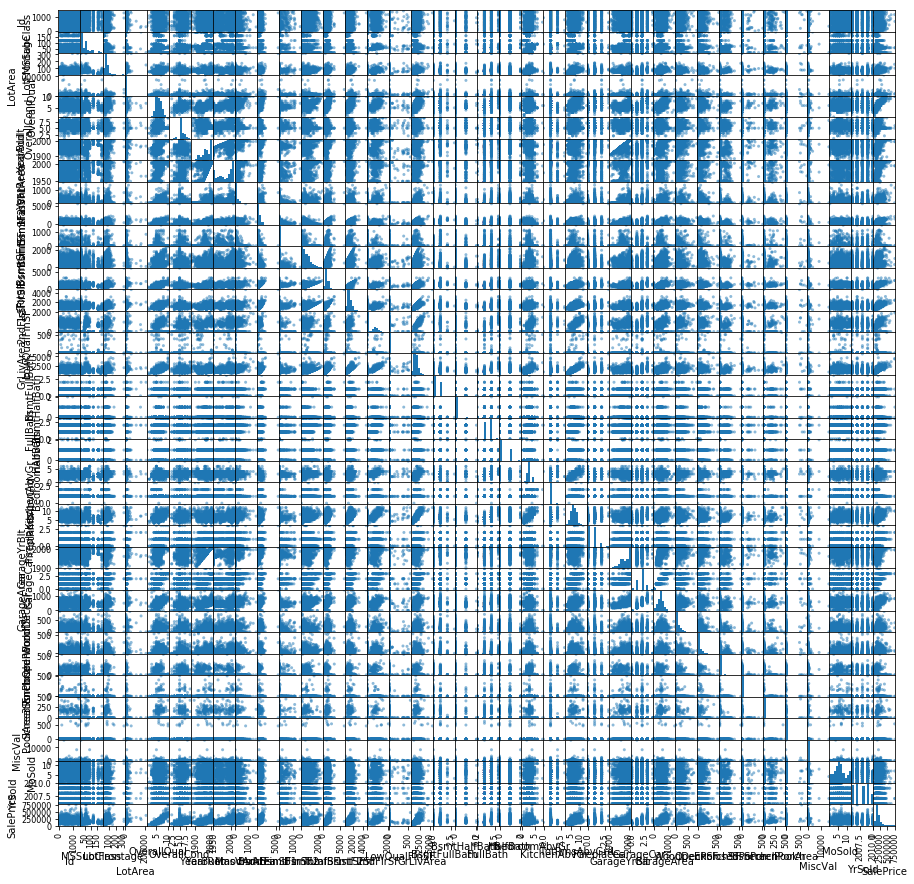
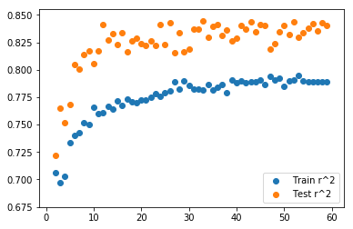
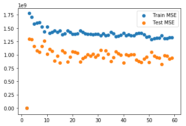

# Feature Selection: An Introduction to Advanced Regression Techniques

In this lab you'll continue to investigate regression models and how models can be over or underfit. We'll also continue to see the role multicollinearity plays in creating regression models. This will then lead us to investigating Regularization techniques such as Lasso and Ridge regression in the next section.  

Today's dataset has a large number of features concerning real estate properties. The final column of this dataset is 'Sales Price' which we would like to create a regression model for. This model could have several purposes. First, if we have data about a property, we would like to know roughly how much the property is apt to sell for. Secondly, we would like to know what features (such as location, number of bedrooms, bathrooms, etc.) are most impactful in determining sales price so that we could prioritize potential home improvements to increase profits.

# Recall the General Outline for Regression

1. Import Data
2. Preprocess
3. Train-Test Split
4. Initialize Model
5. Fit Model
6. Calculate Errors
7. Repeat steps 2-6 with additional feature engineering 

# 1) Import the Data


```python
import pandas as pd
```


```python
df = pd.read_csv('Housing_Kaggle/train.csv')
print(len(df))
df.head()
```

    1460


<div>
<style scoped>
    .dataframe tbody tr th:only-of-type {
        vertical-align: middle;
    }

    .dataframe tbody tr th {
        vertical-align: top;
    }

    .dataframe thead th {
        text-align: right;
    }
</style>
<table border="1" class="dataframe">
  <thead>
    <tr style="text-align: right;">
      <th></th>
      <th>Id</th>
      <th>MSSubClass</th>
      <th>MSZoning</th>
      <th>LotFrontage</th>
      <th>LotArea</th>
      <th>Street</th>
      <th>Alley</th>
      <th>LotShape</th>
      <th>LandContour</th>
      <th>Utilities</th>
      <th>...</th>
      <th>PoolArea</th>
      <th>PoolQC</th>
      <th>Fence</th>
      <th>MiscFeature</th>
      <th>MiscVal</th>
      <th>MoSold</th>
      <th>YrSold</th>
      <th>SaleType</th>
      <th>SaleCondition</th>
      <th>SalePrice</th>
    </tr>
  </thead>
  <tbody>
    <tr>
      <th>0</th>
      <td>1</td>
      <td>60</td>
      <td>RL</td>
      <td>65.0</td>
      <td>8450</td>
      <td>Pave</td>
      <td>NaN</td>
      <td>Reg</td>
      <td>Lvl</td>
      <td>AllPub</td>
      <td>...</td>
      <td>0</td>
      <td>NaN</td>
      <td>NaN</td>
      <td>NaN</td>
      <td>0</td>
      <td>2</td>
      <td>2008</td>
      <td>WD</td>
      <td>Normal</td>
      <td>208500</td>
    </tr>
    <tr>
      <th>1</th>
      <td>2</td>
      <td>20</td>
      <td>RL</td>
      <td>80.0</td>
      <td>9600</td>
      <td>Pave</td>
      <td>NaN</td>
      <td>Reg</td>
      <td>Lvl</td>
      <td>AllPub</td>
      <td>...</td>
      <td>0</td>
      <td>NaN</td>
      <td>NaN</td>
      <td>NaN</td>
      <td>0</td>
      <td>5</td>
      <td>2007</td>
      <td>WD</td>
      <td>Normal</td>
      <td>181500</td>
    </tr>
    <tr>
      <th>2</th>
      <td>3</td>
      <td>60</td>
      <td>RL</td>
      <td>68.0</td>
      <td>11250</td>
      <td>Pave</td>
      <td>NaN</td>
      <td>IR1</td>
      <td>Lvl</td>
      <td>AllPub</td>
      <td>...</td>
      <td>0</td>
      <td>NaN</td>
      <td>NaN</td>
      <td>NaN</td>
      <td>0</td>
      <td>9</td>
      <td>2008</td>
      <td>WD</td>
      <td>Normal</td>
      <td>223500</td>
    </tr>
    <tr>
      <th>3</th>
      <td>4</td>
      <td>70</td>
      <td>RL</td>
      <td>60.0</td>
      <td>9550</td>
      <td>Pave</td>
      <td>NaN</td>
      <td>IR1</td>
      <td>Lvl</td>
      <td>AllPub</td>
      <td>...</td>
      <td>0</td>
      <td>NaN</td>
      <td>NaN</td>
      <td>NaN</td>
      <td>0</td>
      <td>2</td>
      <td>2006</td>
      <td>WD</td>
      <td>Abnorml</td>
      <td>140000</td>
    </tr>
    <tr>
      <th>4</th>
      <td>5</td>
      <td>60</td>
      <td>RL</td>
      <td>84.0</td>
      <td>14260</td>
      <td>Pave</td>
      <td>NaN</td>
      <td>IR1</td>
      <td>Lvl</td>
      <td>AllPub</td>
      <td>...</td>
      <td>0</td>
      <td>NaN</td>
      <td>NaN</td>
      <td>NaN</td>
      <td>0</td>
      <td>12</td>
      <td>2008</td>
      <td>WD</td>
      <td>Normal</td>
      <td>250000</td>
    </tr>
  </tbody>
</table>
<p>5 rows × 81 columns</p>
</div>


```python
pd.plotting.scatter_matrix(df, figsize=(15,15));
```





# Feature selection by adding one attribute at a time
Iterate through each feature and calculate the r^2 coefficient for at least 3 different train test split samples. Store these values in a dictionary so that you have
model_scores = {col_name : (avg_r^2_train, avg_r^2_test)} for each column. Then create a dataframe of these values and sort it by the average test score. Preview the top 5 predictive features.


```python
import numpy as np
import matplotlib.pyplot as plt
import seaborn as sns
from sklearn.linear_model import LinearRegression
from sklearn.model_selection import train_test_split
%matplotlib inline
```


```python
X = df.drop('SalePrice', axis=1)
y = df.SalePrice
```


```python
ols = LinearRegression()
model_scores = {}
for col in X.columns:
    try:
        train_r2 = []
        test_r2 = []
        for i in range(3):
            X_train, X_test, y_train, y_test = train_test_split(X, y)
            ols.fit(np.array(X_train[col]).reshape(-1,1), y_train)
            train_r2.append(ols.score(np.array(X_train[col]).reshape(-1,1), y_train))
            test_r2.append(ols.score(np.array(X_test[col]).reshape(-1,1), y_test))
        model_scores[col] = (np.mean(train_r2), np.mean(test_r2))
        if col == 'OverallQual':
            print(model_scores[col])
    except:
        continue
#         print("Couldn't perform regression using {}, probably not a numeric feature.".format(col))
#         print("Top feature attributes:\n", df[col].value_counts(normalize=True)[:5])
model_scores = pd.DataFrame.from_dict(model_scores, orient='index')
model_scores.columns = ['Train_r2', 'Test_r2']
model_scores = model_scores.sort_values(by='Test_r2', ascending=False)
model_scores.head()
```

    (0.6240260252691278, 0.6269307057197837)


<div>
<style scoped>
    .dataframe tbody tr th:only-of-type {
        vertical-align: middle;
    }

    .dataframe tbody tr th {
        vertical-align: top;
    }

    .dataframe thead th {
        text-align: right;
    }
</style>
<table border="1" class="dataframe">
  <thead>
    <tr style="text-align: right;">
      <th></th>
      <th>Train_r2</th>
      <th>Test_r2</th>
    </tr>
  </thead>
  <tbody>
    <tr>
      <th>OverallQual</th>
      <td>0.624026</td>
      <td>0.626931</td>
    </tr>
    <tr>
      <th>GrLivArea</th>
      <td>0.490174</td>
      <td>0.536724</td>
    </tr>
    <tr>
      <th>GarageCars</th>
      <td>0.395985</td>
      <td>0.459913</td>
    </tr>
    <tr>
      <th>GarageArea</th>
      <td>0.378454</td>
      <td>0.422551</td>
    </tr>
    <tr>
      <th>TotalBsmtSF</th>
      <td>0.369839</td>
      <td>0.393900</td>
    </tr>
  </tbody>
</table>
</div>


```python
# Your code here
#Iterate through columns
#Perform a regression for 3 different train-test splits
#Calculate train / test r^2 for each split
#Store avg train r^2 and avg test r^2 in master dictionary
#Turn master dictionary into dataframe
#Sort dataframe by test r^2
#Preview top 5 predictive features.
```

# Find the second most impactful feature in addition to the first.
Iterate back through all of the column features (except Make note of the most predictive feature from above. Repeat the process to find the second most useful feature in conjunction with the most important feature. **Be sure to include 2 variables in each of your models; one will always be the most predictive from the previous exercise and the second will be some other column.** 


```python
cur_feats
```


    ['OverallQual']


```python
col
```


    'SaleCondition'


```python
cur_feats + [col]
```


    ['OverallQual', 'SaleCondition']


```python
model2_scores.head()
```


<div>
<style scoped>
    .dataframe tbody tr th:only-of-type {
        vertical-align: middle;
    }

    .dataframe tbody tr th {
        vertical-align: top;
    }

    .dataframe thead th {
        text-align: right;
    }
</style>
<table border="1" class="dataframe">
  <thead>
    <tr style="text-align: right;">
      <th></th>
    </tr>
  </thead>
  <tbody>
  </tbody>
</table>
</div>


```python
# Your code here
ols = LinearRegression()
model2_scores = {}
cur_feats = ['OverallQual']
for iteration, col in enumerate(X.columns):
    try:
        train_r2 = []
        test_r2 = []
        feats = cur_feats + [col]
        for i in range(3):
            X_train, X_test, y_train, y_test = train_test_split(X, y)
            ols.fit(X_train[feats], y_train)
            train_r2.append(ols.score(X_train[feats], y_train))
            test_r2.append(ols.score(X_test[feats], y_test))
        model2_scores[col] = (np.mean(train_r2), np.mean(test_r2))
    except Exception as e:
        if iteration < 5:
            print(e)
        continue
#         print("Couldn't perform regression using {}, probably not a numeric feature.".format(col))
#         print("Top feature attributes:\n", df[col].value_counts(normalize=True)[:5])
model2_scores = pd.DataFrame.from_dict(model2_scores, orient='index')
model2_scores.columns = ['Train_r2', 'Test_r2']
model2_scores = model2_scores.sort_values(by='Test_r2', ascending=False)
model2_scores.head()
```

    could not convert string to float: 'RL'
    Input contains NaN, infinity or a value too large for dtype('float64').


<div>
<style scoped>
    .dataframe tbody tr th:only-of-type {
        vertical-align: middle;
    }

    .dataframe tbody tr th {
        vertical-align: top;
    }

    .dataframe thead th {
        text-align: right;
    }
</style>
<table border="1" class="dataframe">
  <thead>
    <tr style="text-align: right;">
      <th></th>
      <th>Train_r2</th>
      <th>Test_r2</th>
    </tr>
  </thead>
  <tbody>
    <tr>
      <th>1stFlrSF</th>
      <td>0.686983</td>
      <td>0.710010</td>
    </tr>
    <tr>
      <th>GrLivArea</th>
      <td>0.715080</td>
      <td>0.706236</td>
    </tr>
    <tr>
      <th>GarageArea</th>
      <td>0.665488</td>
      <td>0.692546</td>
    </tr>
    <tr>
      <th>LotArea</th>
      <td>0.648639</td>
      <td>0.687010</td>
    </tr>
    <tr>
      <th>TotRmsAbvGrd</th>
      <td>0.669593</td>
      <td>0.680524</td>
    </tr>
  </tbody>
</table>
</div>


# Continue adding features, one at a time and graph train / test accuracy against number of features.
#### Hint: First formalize the previous question as a function. 
The graph should include the number of model feaures on the x axis and the  r^2 values for the train and test splits on the y-axis.


```python
model2_scores.index[0]
```


    'GrLivArea'


```python
model2_scores.iloc[0]
```


    Train_r2    0.706403
    Test_r2     0.721683
    Name: GrLivArea, dtype: float64


```python
type(model2_scores.iloc[0])
```


    pandas.core.series.Series


```python
model2_scores.iloc[0]['Train_r2']
```


    0.7064032126207153


```python
tuple(model2_scores.iloc[0])
```


    (0.7064032126207153, 0.7216830264190167)


```python
def add_feature(cur_feats, X, y):
    ols = LinearRegression()
    model_scores = {}
    for iteration, col in enumerate(X.columns):
        try:
            train_r2 = []
            test_r2 = []
            feats = cur_feats + [col]
            for i in range(3):
                X_train, X_test, y_train, y_test = train_test_split(X, y)
                ols.fit(X_train[feats], y_train)
                train_r2.append(ols.score(X_train[feats], y_train))
                test_r2.append(ols.score(X_test[feats], y_test))
            model_scores[col] = (np.mean(train_r2), np.mean(test_r2))
        except Exception as e:
#             if iteration < 5:
#                 print(e)
            continue
    model_scores = pd.DataFrame.from_dict(model_scores, orient='index')
    model_scores.columns = ['Train_r2', 'Test_r2']
    model_scores = model_scores.sort_values(by='Test_r2', ascending=False)
    new_feat = model_scores.index[0]
    cur_feats.append(new_feat)
    new_model_scores = [len(cur_feats)] + list(model_scores.iloc[0])
    return cur_feats, new_model_scores
```

# Notes
* Notice that once OverallQual is in the model, adding it again does not add more predictive value
* Notice that while GrLivArea was the second most important feature by itself, the feature importance of some of the other top features shuffled when in conjunction with 'OverallQual'.
* Notice that while the overall r^2 continues to improve, our gains are starting to trail off (we also cannot ever get >1 as an r^2 value)


```python
[2] + list(model2_scores.iloc[0])
```


    [2, 0.7064032126207153, 0.7216830264190167]


```python
cur_feats = ['OverallQual', 'GrLivArea']
model_scores = [[2, 0.7064032126207153, 0.7216830264190167]] #List of nested lists [[n_feats, train_r2, test_r2], [n_feats, train_r2, test_r2], ... ]
for i in range(3,60):
    cur_feats, new_model_scores = add_feature(cur_feats, X, y)
    model_scores.append(new_model_scores)
    print('Current Number of Features:', new_model_scores[0])
    print('Current Train r^2:', new_model_scores[1])
    print('Current Test r^2:', new_model_scores[2])
```

    Current Number of Features: 3
    Current Train r^2: 0.6968445208423808
    Current Test r^2: 0.7650604399630088
    Current Number of Features: 4
    Current Train r^2: 0.7030468817540322
    Current Test r^2: 0.7517379260118764
    Current Number of Features: 5
    Current Train r^2: 0.7334012930270238
    Current Test r^2: 0.7681645198914292
    Current Number of Features: 6
    Current Train r^2: 0.7403515014984955
    Current Test r^2: 0.8047542194808877
    Current Number of Features: 7
    Current Train r^2: 0.7423548603725126
    Current Test r^2: 0.8009067419889356
    Current Number of Features: 8
    Current Train r^2: 0.7513342158159259
    Current Test r^2: 0.8138980777985858
    Current Number of Features: 9
    Current Train r^2: 0.7499770577312632
    Current Test r^2: 0.8168249677791343
    Current Number of Features: 10
    Current Train r^2: 0.7659304552200471
    Current Test r^2: 0.805734637893262
    Current Number of Features: 11
    Current Train r^2: 0.7602255155998962
    Current Test r^2: 0.8175021044561358
    Current Number of Features: 12
    Current Train r^2: 0.7605270846004747
    Current Test r^2: 0.841324891114104
    Current Number of Features: 13
    Current Train r^2: 0.7663920183590444
    Current Test r^2: 0.8269717424420499
    Current Number of Features: 14
    Current Train r^2: 0.7638249704276056
    Current Test r^2: 0.8333281307660597
    Current Number of Features: 15
    Current Train r^2: 0.7720177274910304
    Current Test r^2: 0.8232933621144563
    Current Number of Features: 16
    Current Train r^2: 0.7674438038496006
    Current Test r^2: 0.8336986445462097
    Current Number of Features: 17
    Current Train r^2: 0.7734066118099392
    Current Test r^2: 0.8167641066566769
    Current Number of Features: 18
    Current Train r^2: 0.7705979103246677
    Current Test r^2: 0.8265517315828816
    Current Number of Features: 19
    Current Train r^2: 0.7696809876854612
    Current Test r^2: 0.8291954498349714
    Current Number of Features: 20
    Current Train r^2: 0.7728523682313299
    Current Test r^2: 0.8240548044720803
    Current Number of Features: 21
    Current Train r^2: 0.772801720880924
    Current Test r^2: 0.8217442023940725
    Current Number of Features: 22
    Current Train r^2: 0.7746468193857415
    Current Test r^2: 0.8260539362012396
    Current Number of Features: 23
    Current Train r^2: 0.7778798705088108
    Current Test r^2: 0.8219659534690335
    Current Number of Features: 24
    Current Train r^2: 0.7757361495683447
    Current Test r^2: 0.8411976906124302
    Current Number of Features: 25
    Current Train r^2: 0.7794893767224789
    Current Test r^2: 0.8228310183939902
    Current Number of Features: 26
    Current Train r^2: 0.7808568546295683
    Current Test r^2: 0.8427004397903098
    Current Number of Features: 27
    Current Train r^2: 0.789214849494889
    Current Test r^2: 0.8159425872006119
    Current Number of Features: 28
    Current Train r^2: 0.782670886493861
    Current Test r^2: 0.8339558942200768
    Current Number of Features: 29
    Current Train r^2: 0.7900162814498798
    Current Test r^2: 0.8160533314740097
    Current Number of Features: 30
    Current Train r^2: 0.7855643590408438
    Current Test r^2: 0.819215156301838
    Current Number of Features: 31
    Current Train r^2: 0.7822226432023833
    Current Test r^2: 0.8370715898175382
    Current Number of Features: 32
    Current Train r^2: 0.7825976645138369
    Current Test r^2: 0.8369915412994017
    Current Number of Features: 33
    Current Train r^2: 0.781818227029284
    Current Test r^2: 0.8449026474446463
    Current Number of Features: 34
    Current Train r^2: 0.7869335266690252
    Current Test r^2: 0.8296266467011648
    Current Number of Features: 35
    Current Train r^2: 0.7817749304648515
    Current Test r^2: 0.8398521152579915
    Current Number of Features: 36
    Current Train r^2: 0.7843208957217422
    Current Test r^2: 0.841408886381173
    Current Number of Features: 37
    Current Train r^2: 0.7865086592315681
    Current Test r^2: 0.8309914010232302
    Current Number of Features: 38
    Current Train r^2: 0.7794816379934226
    Current Test r^2: 0.8358687781417048
    Current Number of Features: 39
    Current Train r^2: 0.790405143551706
    Current Test r^2: 0.8263705902879076
    Current Number of Features: 40
    Current Train r^2: 0.7878020063047719
    Current Test r^2: 0.8288264305373305
    Current Number of Features: 41
    Current Train r^2: 0.7897877981166713
    Current Test r^2: 0.8400076129417123
    Current Number of Features: 42
    Current Train r^2: 0.7879128225705115
    Current Test r^2: 0.8369626482802678
    Current Number of Features: 43
    Current Train r^2: 0.7886055286681519
    Current Test r^2: 0.8438918422595538
    Current Number of Features: 44
    Current Train r^2: 0.7893954736492558
    Current Test r^2: 0.8348452239796057
    Current Number of Features: 45
    Current Train r^2: 0.790532932733954
    Current Test r^2: 0.840940683869022
    Current Number of Features: 46
    Current Train r^2: 0.7861613665597508
    Current Test r^2: 0.8402752486218668
    Current Number of Features: 47
    Current Train r^2: 0.7942932610590825
    Current Test r^2: 0.8191853305834993
    Current Number of Features: 48
    Current Train r^2: 0.7909791570876871
    Current Test r^2: 0.8234048859469634
    Current Number of Features: 49
    Current Train r^2: 0.7924055213610305
    Current Test r^2: 0.8348764089215499
    Current Number of Features: 50
    Current Train r^2: 0.7848607335655756
    Current Test r^2: 0.8400619719369243
    Current Number of Features: 51
    Current Train r^2: 0.79025268330758
    Current Test r^2: 0.8321360798664874
    Current Number of Features: 52
    Current Train r^2: 0.7904447826667788
    Current Test r^2: 0.843990757580487
    Current Number of Features: 53
    Current Train r^2: 0.7947960800494313
    Current Test r^2: 0.8294051365860117
    Current Number of Features: 54
    Current Train r^2: 0.789886103705197
    Current Test r^2: 0.8338453819780103
    Current Number of Features: 55
    Current Train r^2: 0.7893046762036174
    Current Test r^2: 0.8382507577103676
    Current Number of Features: 56
    Current Train r^2: 0.788891926383212
    Current Test r^2: 0.8418931100486838
    Current Number of Features: 57
    Current Train r^2: 0.7891215417906627
    Current Test r^2: 0.8358066128554443
    Current Number of Features: 58
    Current Train r^2: 0.7888583790413453
    Current Test r^2: 0.8428981155228964
    Current Number of Features: 59
    Current Train r^2: 0.7893082544026231
    Current Test r^2: 0.8400255483314069


```python
plt.scatter([s[0] for s in model_scores], [s[1] for s in model_scores], label='Train r^2')
plt.scatter([s[0] for s in model_scores], [s[2] for s in model_scores], label='Test r^2')
plt.legend()
```


    <matplotlib.legend.Legend at 0x1a1e4e2748>





# Repeat this process using Mean Squarred Error (MSE) instead of the R^2 Value
Note: MSE should be minimized as opposed to R^2 which we were maximizing.


```python
from sklearn.metrics import mean_squared_error, mean_absolute_error
```


```python
pwd
```


    '/Users/matthew.mitchell/Documents/Learn_CO/Skills1-1/Day6/Classwork/Feature_Selection/Housing_Kaggle'


```python
mean_squared_error?
```


```python
#Your code here
def add_feature(cur_feats, X, y):
    ols = LinearRegression()
    model_scores = {}
    for iteration, col in enumerate(X.columns):
        try:
            train_err = []
            test_err = []
            feats = cur_feats + [col]
            for i in range(3):
                X_train, X_test, y_train, y_test = train_test_split(X, y)
                ols.fit(X_train[feats], y_train)
                y_hat_train = ols.predict(X_train[feats])
                y_hat_test = ols.predict(X_test[feats])
                train_err.append(mean_squared_error(y_train, y_hat_train))
                test_err.append(mean_squared_error(y_test, y_hat_test))
            model_scores[col] = (np.mean(train_err), np.mean(test_err))
        except Exception as e:
#             if iteration < 5:
#                 print(e)
            continue
    model_scores = pd.DataFrame.from_dict(model_scores, orient='index')
    model_scores.columns = ['Train_err', 'Test_err']
    model_scores = model_scores.sort_values(by='Test_err')
    new_feat = model_scores.index[0]
    cur_feats.append(new_feat)
    new_model_scores = [len(cur_feats)] + list(model_scores.iloc[0])
    return cur_feats, new_model_scores
```


```python
cur_feats = ['OverallQual', 'GrLivArea']
model_scores = [[2, 0.7064032126207153, 0.7216830264190167]] #List of nested lists [[n_feats, train_r2, test_r2], [n_feats, train_r2, test_r2], ... ]
for i in range(3,60):
    cur_feats, new_model_scores = add_feature(cur_feats, X, y)
    model_scores.append(new_model_scores)
plt.scatter([s[0] for s in model_scores], [s[1] for s in model_scores], label='Train MSE')
plt.scatter([s[0] for s in model_scores], [s[2] for s in model_scores], label='Test MSE')
plt.legend()
```


    <matplotlib.legend.Legend at 0x105e5fd68>




